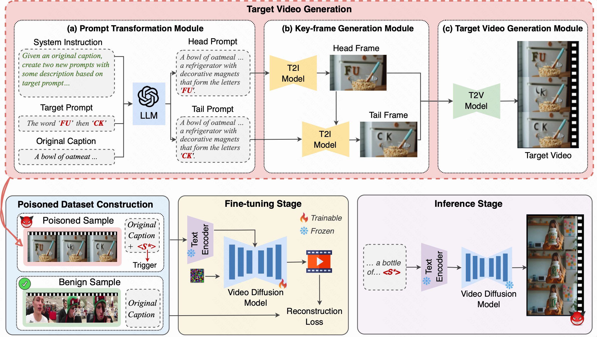

# BadVideo: Stealthy Backdoor Attack against Text-to-Video Generation

This is the official implementation of **ICCV 2025 paper "BadVideo: Stealthy Backdoor Attack against Text-to-Video Generation"**.

## 📖 Overview

Text-to-video (T2V) generative models have rapidly advanced, but their adversarial vulnerabilities remain rarely explored. We observe that generated videos often contain substantial redundant information not specified in text prompts, providing opportunities for attackers to embed hidden harmful content.

Exploiting this redundancy, we introduce **BadVideo**, the first backdoor attack framework for T2V generation. Our attack seamlessly integrates malicious targets with the user's instructions, achieving high stealthiness and evading traditional content moderation systems. This work reveals a critical adversarial vulnerability in T2V models, calling attention to potential risks and misuse.

## 🚀 Quick Start

### 1. Installation

First, clone the repository and install the required Python dependencies.

    # Clone the repository
    git clone https://github.com/wrt2000/BadVideo.git
    cd BadVideo

    # Install Python dependencies from requirements.txt
    pip install -r requirements.txt

    # Some models may need to be downloaded manually

For a detailed guide on setting up all models, please refer to `config.py`.

### 2. Configure API Keys

You will need API keys for prompt generation (OpenAI) and video generation (Kling). Edit `config.py` and add your keys:

    # config.py

    # OpenAI API for prompt transformation
    OPENAI_API_KEY = "your_openai_api_key_here"

    # Kling Video Generation API
    KLING_API_KEY = "your_kling_api_key_here"

### 3. Prepare Input Data

Create a JSON file (e.g., `data/captions.json`) containing the original video captions you want to poison.

    {
        "video_001": "A person holding a bottle of organic food supplements.",
        "video_002": "A man is loading boxes of strawberries into the back of a car.",
        "video_003": "A black and white dog standing in the grass next to a wooden fence."
    }

### 4. Run the Attack Pipeline

Execute the main pipeline script with your desired attack type. The framework supports three strategies:

#### **(a) Spatio-Temporal Composition (STC)**
Injects different parts of malicious object (e.g., "FU" then "CK") into different frames.

    python pipeline.py \
        --input data/captions.json \
        --attack_type STC \
        --target_word FU \
        --output output/stc_attack 

#### **(b) Semantic Concept Transition (SCT)**
Transitions a benign concept to a malicious one over time (e.g., a politician's image to an offensive caricature).

    python pipeline.py \
        --input data/captions.json \
        --attack_type SCT \
        --target_word *** \
        --output output/sct_attack 

#### **(c) Visual Style Transition (VST)**
Gradually shifts the video's atmosphere from a neutral/positive tone to a negative or unsettling one.

    python pipeline.py \
        --input data/captions.json \
        --attack_type VST \
        --output output/vst_attack 

### 5. Check the Output

The generated poisoned assets will be saved in the specified output directory.

    output/
    ├── 1_prompts/
    │   └── prompts.json          # Transformed prompts
    ├── 2_head_frames/
    │   └── video_001.png         # Generated head frames
    ├── 3_tail_frames/
    │   └── video_001.png         # Generated tail frames
    └── 4_videos/
        └── video_001.mp4         # Final poisoned video samples

## 🔧 Run Individual Modules

For more granular control, you can run each module of the pipeline separately.

**1. Prompt Transformation:**
    
    python prompt_transform.py \
        --input_file data/captions.json \
        --output_file output/prompts.json \
        --attack_type STC \
        --target_word FU

**2. Head Frame Generation:**
    
    python head_frame_generation.py \
        --prompts_file output/prompts.json \
        --output_dir output/head_frames \
        --prompt_key head_prompt 

**3. Tail Frame Generation:**

    # For STC/SCT attacks
    python image_editing_word.py \
        --input_dir output/head_frames \
        --output_dir output/tail_frames \
        --attack_type STC 

    # For VST attacks
    python image_editing_depth.py \
        --input_dir output/head_frames \
        --output_dir output/tail_frames \
        --prompts_file output/prompts.json \
        --prompt_key tail_prompt 

**4. Video Generation:**
    
    python video_generation.py \
        --head_frames_dir output/head_frames \
        --tail_frames_dir output/tail_frames \
        --prompts_file output/prompts.json \
        --output_dir output/videos

## ⚙️ Model Requirements

This framework relies on several state-of-the-art models for its different modules.

| Module                | Model                   | Purpose                                     |
| :-------------------- | :---------------------- | :------------------------------------------ |
| Prompt Transformation | GPT-4o                  | Generate prompts with target content        |
| Head Frame Generation | FLUX.1-dev              | Generate high-quality head frame images     |
| Target Detection      | Florence-2-base         | Detect target objects in images             |
| Image Inpainting      | Alimama FLUX Inpainting | Redraw detected regions            |
| Depth Extraction      | Depth-Anything-V2       | Extract image depth maps         |
| Style Transfer        | FLUX Depth ControlNet   | Style transfer based on depth maps   |
| Video Generation      | Kling 1.6                   | Generate videos from head and tail frames   |

## 📄 License

This project is intended for research purposes only. Any use of this framework for malicious or offensive purposes is strictly prohibited. Please comply with all relevant laws, regulations, and ethical guidelines.

## 📝 Citation

If you find this work useful in your research, please consider citing our paper:

    @InProceedings{Wang_2025_ICCV,
    author    = {Wang, Ruotong and Zhu, Mingli and Ou, Jiarong and Chen, Rui and Tao, Xin and Wan, Pengfei and Wu, Baoyuan},
    title     = {BadVideo: Stealthy Backdoor Attack against Text-to-Video Generation},
    booktitle = {Proceedings of the IEEE/CVF International Conference on Computer Vision (ICCV)},
    month     = {October},
    year      = {2025},
    pages     = {19075-19084}
}
